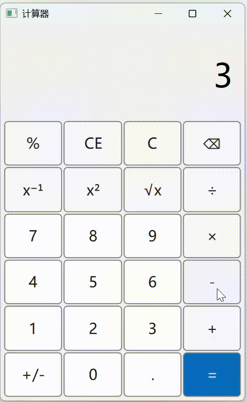

# EasyCalculator

一个使用 QML 编写的简洁美观的计算器应用。

## 演示



## 功能特性

### 基本运算
- ➕ 加法
- ➖ 减法
- ✖️ 乘法
- ➗ 除法

### 高级功能
- **百分比计算** (`%`): 将当前值转换为百分比
- **平方** (`x²`): 计算当前值的平方
- **平方根** (`√x`): 计算当前值的平方根
- **倒数** (`x⁻¹`): 计算当前值的倒数
- **正负号切换** (`+/-`): 切换当前值的正负号

### 操作功能
- **清除** (`C`): 清除所有输入和运算
- **清除当前项** (`CE`): 只清除当前显示的值
- **退格** (`⌫`): 删除最后一位数字
- **小数点** (`.`): 输入小数点（防止重复输入）

## 技术栈

- **Qt 6.4+**: 跨平台应用框架
- **QML**: 声明式 UI 语言
- **C++**: 后端逻辑实现
- **CMake 3.20+**: 构建系统

## 系统要求

- Qt 6.4 或更高版本
- CMake 3.20 或更高版本
- C++ 编译器（支持 C++17 标准）
- Windows / Linux / macOS

## 构建步骤

### 1. 克隆项目

```bash
git clone <repository-url>
cd EasyCalculator
```

### 2. 创建构建目录

```bash
mkdir build
cd build
```

### 3. 配置项目

```bash
cmake ..
```

### 4. 编译

```bash
cmake --build .
```

### 5. 运行

**Windows:**
```bash
.\EasyCalculator\EasyCalculator.exe
```

**Linux/macOS:**
```bash
./EasyCalculator/EasyCalculator
```

## 项目结构

```
EasyCalculator/
├── Main.qml                 # 主界面文件
├── calculator.h             # 计算器类头文件
├── calculator.cpp           # 计算器类实现
├── main.cpp                 # 程序入口
├── CMakeLists.txt          # CMake 构建配置
├── buttons/                 # 按钮组件目录
│   ├── NumberButton.qml    # 数字按钮组件
│   ├── FunctionalButton.qml # 功能按钮组件
│   └── EqualSignButton.qml # 等号按钮组件
└── README.md               # 项目说明文档
```

## 使用说明

1. **输入数字**: 点击数字按钮输入数字
2. **选择运算符**: 点击 `+`、`-`、`×`、`÷` 选择运算
3. **计算结果**: 点击 `=` 按钮执行计算
4. **清除操作**: 
   - 点击 `C` 清除所有内容
   - 点击 `CE` 只清除当前显示的值
5. **高级功能**: 点击相应的功能按钮（如 `%`、`x²`、`√x` 等）执行对应计算

## 界面说明

- **过程显示区**: 显示当前的计算过程
- **结果显示区**: 显示计算结果或当前输入的数字
- **按钮布局**: 采用 4 列网格布局，符合常见计算器的使用习惯

## 开发说明

### 核心类

- `Calculator`: C++ 后端类，负责所有计算逻辑
  - 使用 Qt 的信号槽机制与 QML 界面通信
  - 通过 `Q_PROPERTY` 暴露属性给 QML
  - 通过 `Q_INVOKABLE` 暴露方法给 QML

### 自定义组件

- `NumberButton`: 数字按钮组件
- `FunctionalButton`: 功能按钮组件
- `EqualSignButton`: 等号按钮组件

## 许可证

查看 [LICENSE](LICENSE) 文件了解详情。

## 贡献

欢迎提交 Issue 和 Pull Request！

## 作者

Qt 学习项目 - QML 计算器示例
